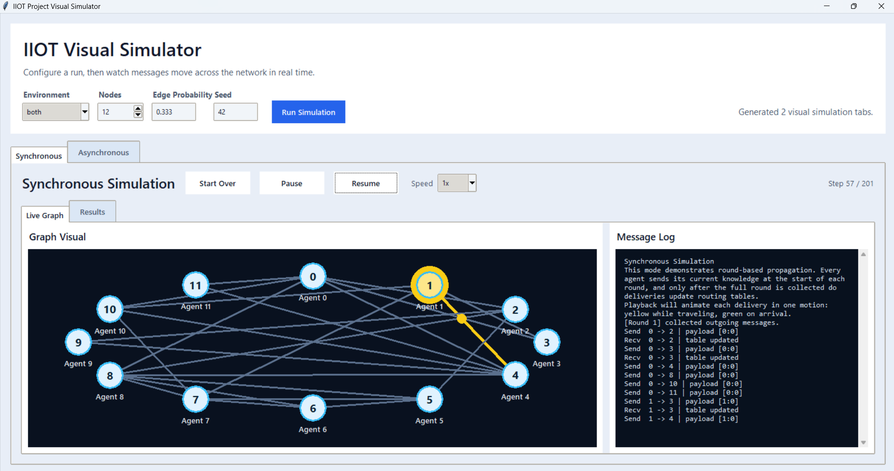
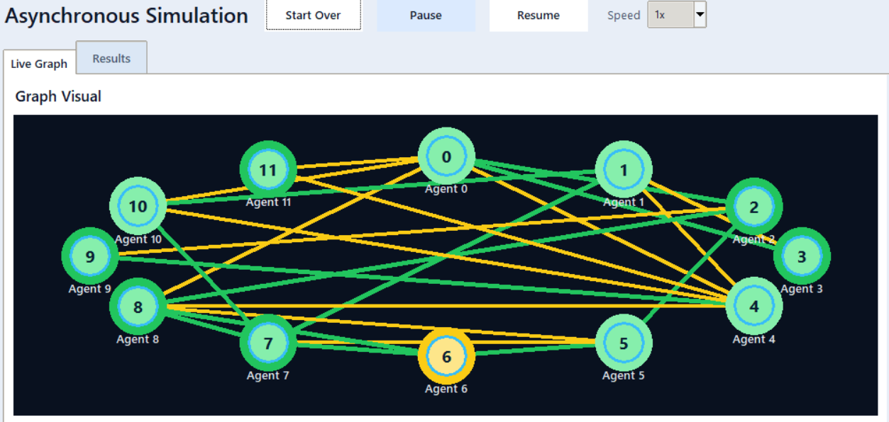
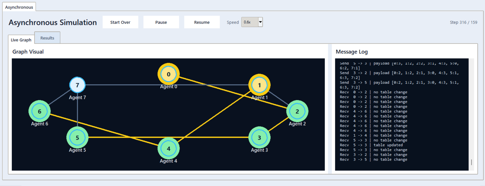
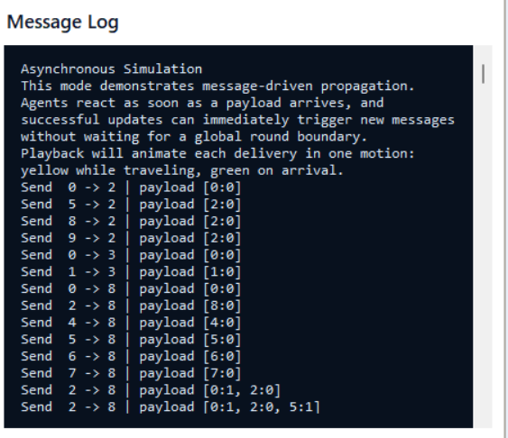
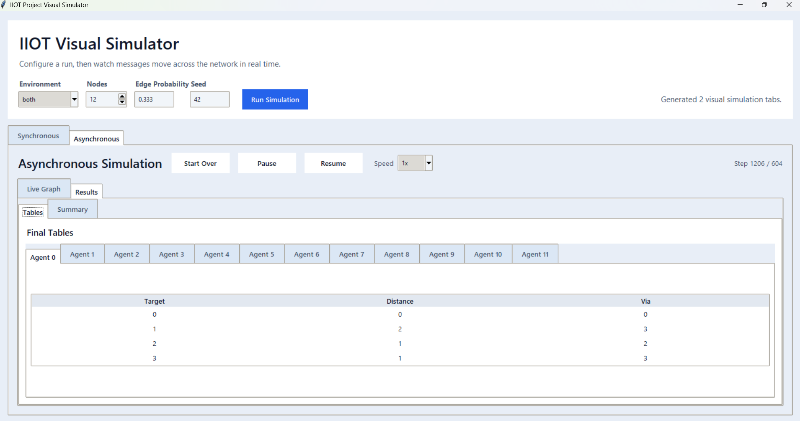
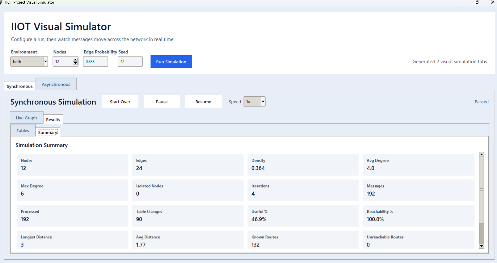
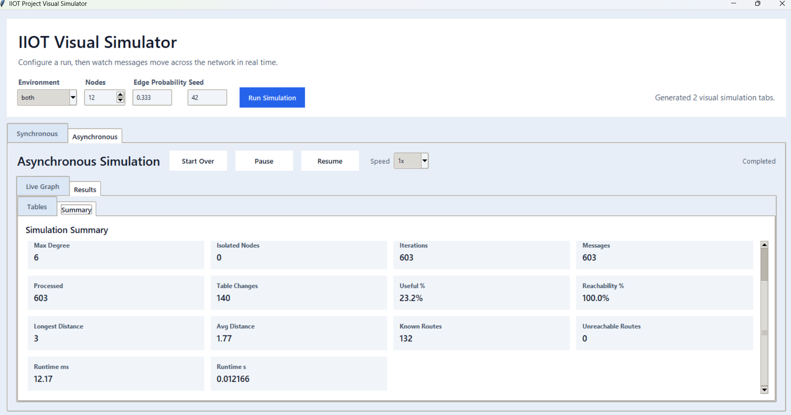

# IIOT Project Visuals

Desktop Tkinter visual simulator for an IIOT routing exercise. The project generates an undirected agent network, runs the same update-table algorithm in both synchronous and asynchronous environments, and visualizes how routing knowledge propagates until convergence.

## Project Description

This project was built to study the behavioral difference between two distributed execution environments:

- a **synchronous environment**, where all agents act in explicit rounds
- an **asynchronous environment**, where each agent reacts independently when messages arrive

Both environments run the same routing-table update rule. The GUI allows the user to configure a network, run one or both simulators, and inspect the resulting message flow, final agent tables, and convergence metrics.

## Objectives

The system is designed to support the following academic goals:

- model a network of agents connected by probabilistic neighbor relationships
- implement a table-based update algorithm for distributed routing knowledge
- compare synchronous round-based execution with asynchronous message-driven execution
- measure convergence behavior, message counts, and final reachability
- provide a visual explanation of how the algorithm evolves over time

## System Overview

The application consists of:

- a **graph generator** that creates a random undirected network from user parameters
- a **shared data model** for agents, messages, and update tables
- a **synchronous simulator**
- an **asynchronous simulator**
- a **Tkinter visualizer** that replays simulation traces and presents tables and metrics

## Visual Overview

### Main Application Window

This view shows the configuration controls and the generated simulation tabs.



The interface lets the user choose:

- environment: synchronous, asynchronous, or both
- number of agents
- edge probability
- random seed

After the run starts, each environment receives its own tab with playback controls, a live graph, a message log, final routing tables, and a summary view.

### Live Graph Playback

The graph visualization illustrates message propagation directly on the network.



Interpretation of the visual states:

- **yellow path and dot**: a message currently traveling
- **green edge highlight**: a delivered message that changed a table
- **plain nodes and edges**: inactive graph state

This makes it possible to see the difference between ordered synchronous propagation and overlapping asynchronous propagation.

### Asynchronous Execution Example

The following screen captures the asynchronous environment during active execution, with the live graph and the message log visible at the same time.



This view is useful for observing that:

- multiple message chains may overlap in time
- delivery order is driven by message arrival rather than round boundaries
- some received messages do not change the table and are therefore recorded as `no table change`

### Message Log

The message log provides a textual trace of the same execution.



The log is useful for connecting the visual animation to the underlying algorithmic actions:

- outgoing sends
- payload contents
- delivery order
- whether a received message updated the table

### Final Routing Tables

Each agent has its own final table view after the simulation completes.



These tables allow direct inspection of:

- known targets
- final shortest distances
- the neighbor used as the current forwarding choice (`via`)

### Summary Metrics

The summary tab collects graph statistics and convergence metrics in a structured form.





These values support comparison between the two environments for the same generated network.

## Project Structure

- `main.py` - application entrypoint
- `backend/config.py` - default constants such as seed, iteration limit, and async timeout
- `backend/network.py` - random graph generation
- `backend/models.py` - `Agent`, `Message`, `TableRow`, and `UpdateTable`
- `backend/simulations.py` - synchronous and asynchronous runtime logic plus trace recording
- `frontend/visualizer.py` - Tkinter GUI and playback system
- `screenshots/` - repository screenshots used in this README
- `docs/` - assignment/reference material

## Core Models

The backend uses three main logical entities.

### Agent

An `Agent` represents one node in the network. Each agent has:

- a unique integer identifier
- a set of neighbors
- its own update table

### Message

A `Message` represents one transmission from a sender to a receiver.

Its payload contains only:

- `{target: distance}`

The payload intentionally excludes the `via` column. The receiving agent reconstructs `via` locally as the sender of the message.

### Update Table

Each agent stores its current knowledge in an `UpdateTable`. Every row contains:

- `target` - destination agent ID
- `distance` - known distance to that destination
- `via` - neighbor through which the destination is reached

Each agent starts with exactly one row:

- `(self, 0, self)`

This means every agent initially knows only how to reach itself.

## Update Algorithm

The update algorithm is implemented in `UpdateTable.process_incoming_payload(...)`.

When an agent `Ai` receives a payload from neighbor `Aj`, it processes every received `(target, distance)` pair as follows:

1. Compute `candidate_distance = received_distance + 1`.
2. If the target does not exist in `Ai`'s table, add a new row:
   - `(target, candidate_distance, Aj)`
3. If the target already exists but the stored distance is larger than `candidate_distance`, replace the row:
   - `(target, candidate_distance, Aj)`
4. Otherwise, keep the existing row.

This is a shortest-path style distance-vector update rule. A table changes only when new information introduces a previously unknown target or a shorter path.

## Execution Environments

The same update rule is executed in two different environments.

### Synchronous Environment

In the synchronous simulator, time is divided into explicit rounds.

Round logic:

1. At the beginning of the round, every agent prepares its outgoing messages from its current table.
2. These messages are stored in the current round buffer.
3. All current-round messages are processed.
4. If any table changed, the next wave of messages is generated for the next round.
5. Newly generated messages are not allowed to affect the current round.

Implications:

- all agents conceptually observe the same round boundary
- same-round cascades are prevented
- convergence occurs when a full round finishes with no table changes

### Asynchronous Environment

In the asynchronous simulator, each agent is represented by its own worker thread.

Execution logic:

1. Each agent owns an inbox queue.
2. The worker blocks until a message arrives.
3. On message arrival, the agent updates its table immediately.
4. If the table changed, the agent immediately broadcasts its updated payload to neighbors.
5. There is no global round barrier.

Implications:

- updates can propagate immediately
- multiple causal chains may overlap in time
- convergence occurs when no message remains queued or in flight

## How the Application Works

The full runtime flow is:

1. The user enters the simulation parameters.
2. The graph generator creates an undirected random network.
3. The graph is converted into `Agent` objects.
4. The selected simulator runs:
   - `SynchronousSimulator`
   - `AsynchronousSimulator`
5. During execution, the backend records structured events such as:
   - message sent
   - message processed
   - round start and round end
   - convergence
6. The frontend replays those events in the GUI and shows:
   - live graph animation
   - textual message log
   - final routing tables
   - summary metrics

## Convergence and Measurement

The project measures convergence using the assignment's operational meaning: the system has converged when no more useful table changes occur.

### Synchronous convergence

- convergence is detected when an entire round completes with zero table changes

### Asynchronous convergence

- convergence is detected when no queued or active message remains in the system

### Reported metrics

The summary view includes:

- node count
- edge count
- density
- degree statistics
- number of iterations or processed steps
- total messages sent
- total messages processed
- total table changes
- useful message percentage
- reachability percentage
- longest and average final distance
- runtime in milliseconds and seconds

These values make it possible to compare algorithmic behavior between the two environments on the same graph instance.

## Requirements

The project currently uses only the Python standard library. Python 3.10 or newer is recommended because the code uses modern type hint syntax.

Tkinter is required for the GUI and is included with most standard Python installations on Windows.

## Setup

Create and activate a virtual environment:

```powershell
python -m venv .venv
.\.venv\Scripts\Activate.ps1
```

Install dependencies:

```powershell
pip install -r requirements.txt
```

The requirements file is intentionally minimal because the project currently depends only on the standard library.

## Run the Visualizer

```powershell
python main.py
```

## Academic Notes

From an academic perspective, the project is intended to highlight that:

- the **algorithm** can remain fixed while the **execution environment** changes
- synchronous execution is easier to reason about because round boundaries are explicit
- asynchronous execution can be more dynamic but requires careful thinking about causality and termination

The visual interface was designed to make those differences observable rather than purely theoretical.
